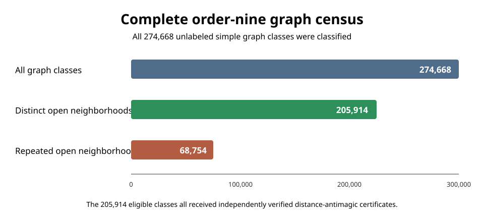

# Distance-antimagic conjecture through order nine

[](#principal-result)
[](#scope-and-novelty)

This is the preserved landing page for the original computational study **“Exhaustive Verification of the Distance-Antimagic Open-Neighborhood Conjecture Through Order Nine.”**

**[Read the paper](paper/study.md)** · **[Results summary](RESULTS.md)** · **[Reproduce the computation](#reproduction)**



## Principal result

A simple graph is distance-antimagic when its vertices can be bijectively labeled `1,...,n` so that every open-neighborhood label sum is different. If two vertices have identical open neighborhoods, equal weights are unavoidable. The computation establishes that this obstruction is the **only** obstruction for every simple graph through order nine.

> **Finite theorem.** Every simple graph with at most nine vertices is distance-antimagic if and only if its open neighborhoods are pairwise distinct.
>
> **Corollary.** Any counterexample to the general Kamatchi–Arumugam conjecture must have at least 10 vertices.

For order nine, all **274,668** unlabeled simple graph classes were processed. Exactly **205,914** have pairwise-distinct open neighborhoods; every one received an explicit distance-antimagic labeling. The remaining **68,754** have a repeated open neighborhood and therefore fail necessarily. Two independent verifiers accepted all 205,914 positive certificates with **zero failures**.

See [`RESULTS.md`](RESULTS.md) for the quantitative checks and [`paper/study.md`](paper/study.md) for the complete methods, literature review, limitations, and novelty analysis.

## Transparent publication layout

This repository intentionally contains **no opaque base64/gzip bootstrap payloads and no GitHub Actions workflows**. Everything committed here is ordinary inspectable source, Markdown, CSV/TSV/JSON, or SVG.

The two approximately 13 MB complete certificate TSVs are not hidden inside encoded blobs. They are regenerated deterministically from the published C++ constructor. Their expected SHA-256 digests are published in [`results/CERTIFICATES.md`](results/CERTIFICATES.md), and a human-readable sample is committed as [`results/order9_certificate_sample.tsv`](results/order9_certificate_sample.tsv). The authoritative order-nine graph catalogue is downloaded directly from Brendan McKay's ANU collection and hash-checked before use.

## Reproduction

Requirements for the central computation are Python 3 and a C++20 compiler. NetworkX is optional for the second verifier.

```bash
python3 -m pip install -r requirements.txt
bash reproduce.sh primary
bash reproduce.sh full
```

The canonical outputs are expected to satisfy:

```text
839f67ecc73b1f539128694badebe27adf4f0fb1ee6d0663b7ad9868100d5123  data/graph9.g6
da32bb36f59a8999c735b4d1d585b372d9de665facc1c2ae3e55fb0025516bf1  generated/order9_primary_certificates.tsv
```

## Scope and novelty

Previous exhaustive work reported verification through order eight. A result-specific literature search performed after the computation did not locate an earlier exhaustive order-nine verification or complete order-nine certificate construction. The study therefore **appears to be a previously unreported computational extension** as of 8 August 2026. This is deliberately qualified: unindexed or private work cannot be ruled out, and the manuscript has not yet undergone external peer review.

The significance is best described as a **meaningful incremental frontier result**, not a resolution of the full conjecture.

## Key source references

- N. Kamatchi and S. Arumugam, *Distance Antimagic Graphs*, JCMCC 84 (2013), 61–67.
- R. Simanjuntak et al., *Another Antimagic Conjecture*, *Symmetry* 13 (2021), 2071.
- B. D. McKay, *Combinatorial Data: Simple Graphs*.
